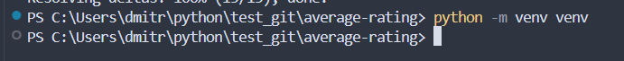

# Brand Ratings Analysis

Проект анализирует рейтинги брендов на основе CSV-файлов с данными о товарах и формирует отчёты, например **average-rating**, где выводится средний рейтинг бренда, отсортированный по убыванию.

---

## Функционал

- Чтение одного или нескольких CSV-файлов с товарами.
- Формирование отчёта **average-rating** с выводом таблицы в консоль.
- Параметры:
  - `--files` — пути к CSV-файлам
  - `--report` — название отчёта

---

## Запуск проекта из Git

Если проект клонируется с GitHub, сначала клонируйте репозиторий и создайте виртуальное окружение:

```bash
# Клонируем репозиторий
git clone https://github.com/Rozzenant/average-rating.git
cd average-rating
```


```bash
# Создаём и активируем виртуальное окружение
python -m venv venv
```



```bash
# Windows
venv\Scripts\activate
```


```bash
# Mac/Linux
source venv/bin/activate
```

```bash
# Устанавливаем зависимости
pip install -r requirements.txt
```


```bash
# Запуск отчёта
python python main.py --files .\data\products1.csv .\data\products2.csv --report average-rating
```


```bash
# Запуск тестов с покрытием
pytest --cov=reports tests/
```


